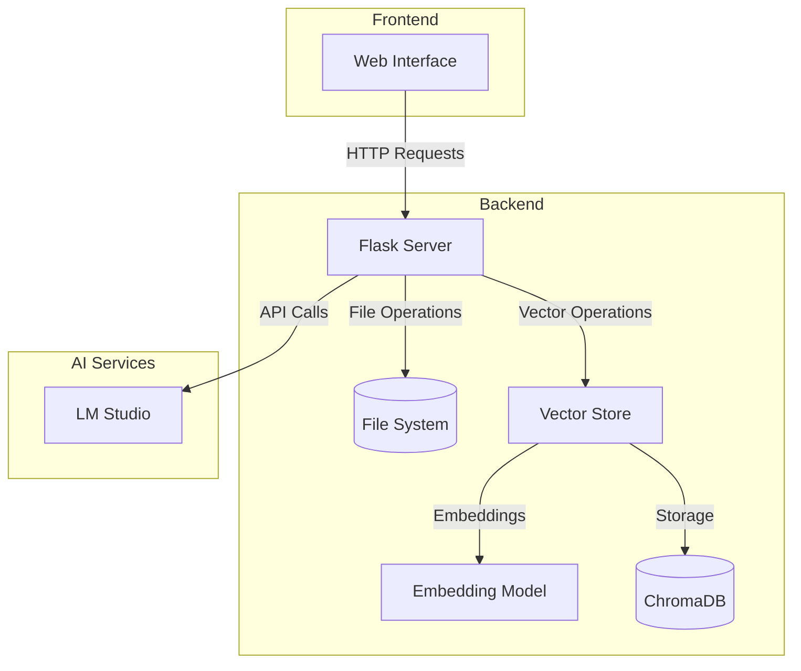

# **Technical Guide: LM Studio Chat Interface with Vector Search**

This comprehensive guide explains the architecture, implementation details, and customization options for the LM Studio Chat Interface with semantic search capabilities.

## **📋 Table of Contents**

1. [Architecture Overview](#architecture)
2. [Component Breakdown](#components)
3. [Data Flow](#data-flow)
4. [Vector Processing](#vector-processing)
5. [Implementation Details](#implementation)
6. [Customization Guide](#customization)
7. [Security Considerations](#security)
8. [Performance Optimization](#performance)
9. [Troubleshooting Guide](#troubleshooting)

## **🏗️ Architecture Overview** {#architecture}

The application follows a client-server architecture with vector storage capabilities:



### **Key Components:**
- **Web Interface**: HTML/CSS/JavaScript frontend
- **Flask Server**: Python backend handling requests
- **Vector Store**: Document embedding and semantic search
- **Embedding Model**: MiniLM for text vectorization
- **ChromaDB**: Vector database for similarity search
- **File System**: Local storage for uploaded documents
- **LM Studio Integration**: API connection to LM Studio

## **🔍 Component Breakdown** {#components}

### **1. Frontend Components**

- **Upload Section**: Handles file uploads with status feedback
- **File List**: Displays available documents
- **Status Monitor**: Shows initialization and processing status
- **Configuration Panel**: LM Studio connection settings
- **Chat Interface**: Message input and display
- **Copy Functionality**: One-click file referencing

### **2. Backend Services**

- **File Management**: Upload and retrieval
- **Vector Processing**: Document embedding and search
- **Chat Processing**: Context-aware message handling
- **Model Integration**: Automatic model detection
- **Error Handling**: Comprehensive error management

## **📊 Data Flow** {#data-flow}

1. **Document Processing Flow:**
   ```mermaid
   sequenceDiagram
       participant User
       participant Frontend
       participant Flask
       participant Vector Store
       participant ChromaDB
       
       User->>Frontend: Upload Document
       Frontend->>Flask: POST /upload
       Flask->>Vector Store: Process Document
       Vector Store->>ChromaDB: Store Embeddings
       Flask->>Frontend: Update Status
       Frontend->>User: Show Success
   ```

2. **Chat Process with Vector Search:**
   ```mermaid
   sequenceDiagram
       participant User
       participant Frontend
       participant Flask
       participant Vector Store
       participant LM Studio
       
       User->>Frontend: Send Query
       Frontend->>Flask: POST /chat
       Flask->>Vector Store: Search Similar Content
       Vector Store->>Flask: Return Relevant Chunks
       Flask->>LM Studio: Send Augmented Prompt
       LM Studio->>Frontend: Return Response
       Frontend->>User: Display Response
   ```

## **🔢 Vector Processing** {#vector-processing}

### **1. Document Embedding**

```python
class EmbeddingModel:
    def encode_documents(self, documents):
        """Convert documents to vectors."""
        return self.model.encode(documents, normalize_embeddings=True)

    def encode_query(self, query):
        """Convert query to vector with proper prompt."""
        prompt = "Represent this sentence for searching relevant passages: "
        return self.model.encode(f"{prompt}{query}")
```

### **2. Vector Storage**

```python
class VectorStore:
    def add_document(self, filename, content):
        """Process and store document vectors."""
        chunks = self._split_into_chunks(content)
        embeddings = self.embedding_model.encode_documents(chunks)
        
        self.collection.add(
            embeddings=embeddings.tolist(),
            documents=chunks,
            ids=self._generate_ids(chunks),
            metadatas=self._create_metadata(filename, chunks)
        )

    def query_similar(self, query, n_results=5):
        """Find similar content using vector similarity."""
        query_embedding = self.embedding_model.encode_query(query)
        return self.collection.query(
            query_embeddings=[query_embedding.tolist()],
            n_results=n_results
        )
```

## **💻 Implementation Details** {#implementation}

### **1. Initialization System**

```python
def initialize_vector_store():
    """Initialize vector store in background."""
    try:
        vector_store = VectorStore(persist_directory="vector_db")
        initialization_complete = True
    except Exception as e:
        initialization_error = str(e)
    finally:
        is_initializing = False
```

### **2. Message Processing**

Messages are processed in stages:
1. Extract file references
2. Search for relevant context
3. Construct augmented prompt
4. Send to LM Studio
5. Process and format response

### **3. Error Handling**

Comprehensive error handling for:
- Initialization failures
- Embedding errors
- Vector storage issues
- File operations
- LM Studio connection

## **🎨 Customization Guide** {#customization}

### **1. Vector Search Configuration**

Customize search behavior:
```python
# Adjust chunk size
chunk_size = 1000  # characters

# Modify number of results
n_results = 5  # chunks to return

# Set similarity threshold
min_similarity = 0.7
```

### **2. Embedding Options**

Configure embedding generation:
```python
# Change embedding dimensions
dimensions = 512  # default 1024

# Adjust normalization
normalize_embeddings = True
```

### **3. UI Customization**

Modify the interface through:
- CSS styling
- Status indicators
- Response formatting
- Mobile responsiveness

## **🔒 Security Considerations** {#security}

1. **File Security**
   - Content validation
   - Size limits
   - Path traversal prevention

2. **Vector Storage Security**
   - Data isolation
   - Access control
   - Error handling

## **⚡ Performance Optimization** {#performance}

1. **Vector Processing**
   - Batch processing
   - Caching strategies
   - Efficient chunking

2. **Search Optimization**
   - Index optimization
   - Query vectorization
   - Result caching

## **🔧 Troubleshooting Guide** {#troubleshooting}

### **Common Issues and Solutions**

1. **Initialization Issues**
   ```
   Error: Model loading failed
   Solution: Verify embedding model installation
   ```

2. **Vector Storage Issues**
   ```
   Error: ChromaDB connection failed
   Solution: Check storage directory permissions
   ```

3. **Search Issues**
   ```
   Error: No results found
   Solution: Verify document processing and indexing
   ```

## **📈 Future Improvements**

Potential enhancements:
1. Advanced chunking strategies
2. Multi-model embedding support
3. Real-time indexing
4. Search result caching
5. Custom embedding training

## **🔍 Debugging Tips**

Monitor system status:
```python
# Check initialization
print(f"Initialization status: {initialization_complete}")

# Monitor vector operations
print(f"Vector dimensions: {embeddings.shape}")

# Track search performance
print(f"Found {len(results)} relevant chunks")
```

---

This guide serves as a comprehensive reference for understanding and implementing the LM Studio Chat Interface with vector search capabilities. For specific questions or issues, refer to the relevant sections or create an issue in the repository.